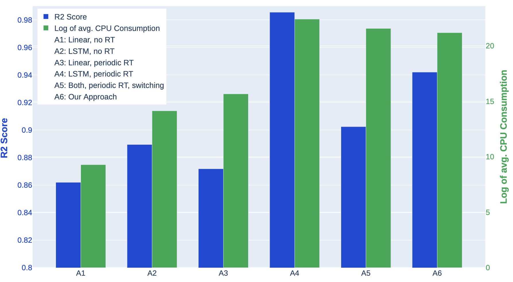

# Towards Sustainable MLOps: A Self-Adaptation Approach

Hiya Bhatt, Shrikara Arun, Adyansh Kakran and Karthik Vaidhyanathan
Preprint: https://arxiv.org/abs/2404.04572
---

## About
This repository contains the associated code for our submission to ICSA Poster Track, where we implement the case study as described in Section III of the paper.  

This pipeline conducts time series prediction of [Air Quality Index (AQI)](https://en.wikipedia.org/wiki/Air_quality_index) using the following features:
- Calibrated PM2.5 level
- Calibrated PM10 level
- Calibrated Temperature
- Calibrated Humidity

Using the features and measured AQI for the past 5 minutes, we predict the AQI of the next minute. The data are from 10 outdoor and 5 indoor sensor nodes in deployed in the IIIT Hyderabad campus.

The pipeline uses two model types - linear regression as a lightweight but less accurate model and Long Short Term Memory (LSTM) network as a more accurate but more energy intensive model type. We use [SciKit Learn](https://scikit-learn.org/stable/) for linear regression implementation and [TensorFlow](https://www.tensorflow.org/) for LSTM implementation. [pyRAPL](https://pypi.org/project/pyRAPL/) is used for monitoring CPU consumption.

> [!WARNING]
> [pyRAPL](https://pyrapl.readthedocs.io/en/latest/), used for monitoring CPU consumption is only available on Intel CPUs from the Sandy Bridge generation (2nd gen) onwards.

### Approaches Tested
A1: Linear regression only, no retraining.  
A2: LSTM network only, no retraining.  
A3: Linear regression only, periodic retraining.  
A4: LSTM network only, periodic retraining.  
A5: Both linear regression and LSTM network, periodic retraining of both, switching between models  based on energy usage - switch to linear regression if the average CPU consumption of the LSTM is above the max average CPU consumption threshold and switch back to LSTM if the periodic check of LSTM average CPU consumption is below the max threshold.  
A6: Our approach.  

---
## Project Structure

## Installation
- Create a virtual environment with `python -m venv .venv` and activate it with `source .venv/bin/activate`.  
- Install the required packages with `pip install -r requirements.txt`. 
- Please go through the code and change the path to your system's absolute path wherever prompted.

## Configuration Used During Experimentation

### Hardware Used
Processor: Intel Core i7-6700K  
Memory: 16.0 GiB  
> [!NOTE]
> Only CPU device was used, both during training and inference.

### Thresholds Set
The thresholds used are: 
- periodic retraining interval: $5$ mins
- drift detection interval: $5$ mins
- average CPU consumption monitoring interval: $10s$
- [KL divergence](https://en.wikipedia.org/wiki/Kullback%E2%80%93Leibler_divergence) threhold $1.6$ for LSTM and $0.6$ for linear regression 
- average CPU consumption max threshold: $1.5 * 10^6 \mu J$  

The same parameters are used in all alternate approaches as well.

## Running the approaches
To run the different approaches follow the steps given below (make sure you are in the root directory of this project): 
### A1 & A2: 
This approach is for testing the single models.
- Open the Model_reload/model.csv
- If you want to make inferences using linear model write 'general_model' in model.csv
- If you want to make inferences using LSTM model write 'lstm' in model.csv
- Run `cd Approach(A1&A2) && python3 main.py` in the terminal.

### A3 & A4:
This approach is for testing the single models along with periodic retraining of those single models. 
- Open the Model_reload/model.csv
- If you want to make inferences using linear model write 'general_model' in model.csv
- If you want to make inferences using LSTM model write 'lstm' in model.csv
- In Approach(A3&A4)/Analyser_periodic.py in the function analyse_drift create planner object only for the model that you are testing. for eg example if you are yesting the lstm model you will create the planner object like this `self.planner.divergence_detected('lstm')`
- Once done with the above steps run `cd Approach(A3&A4) && python3 main.py` in first terminal
- In the second terminal run `cd Approach(A3&A4) && python3 Monitor_periodic.py`
- In the third terminal run `cd Approach(A3&A4) && training_subsystem.py`

### A5:
This approach is for testing both the models along with switching between those models and periodic retraining of those models.
- In the first terminal run `cd Approach(A5) && main.py`
- In the second terminal run `cd Approach(A5) && Monitor_periodic.py`
- In the third terminal run `cd Approach(A5) && training_subsystem.py`

### A6:
This approach is for testing both the models along with switching between those models and retraining of those models only if drift is detected.
- In the first terminal run `cd Approach(A6) && main.py` 
- In the second terminal run `cd Approach(A6) && Monitor.py`
- In the thrid terminal run `cd Approach(A6) && training_subsystem.py`

## Results

After running any of the above approaches, the results will be saved in `Results/`. 
- For all the approaches the prediction results will be saved in `Results/prediction_results.csv`
- For approaches A3, A4, A5 and A6 the retraining results will be stored in `Results/retraining_results.csv`
- For approaches A3, A4, A5 and A6 the versioned models will be stored in `versioned/models/model_name/`

Our approach (A6) strikes a balance between performance, measured by $R^2$ score and average CPU consumption over the past $10s$, measured in $\mu J$. While using only the LSTM with periodic retraining (A3) offers the best $R^2$ score, it consumes significantly more energy than other approaches. 
Our approach, as compared to periodically retraining both models and switching between them (A5), improves $R^2$ score from $0.90$ to $0.94$ and reduces average CPU consumption by $32$%.